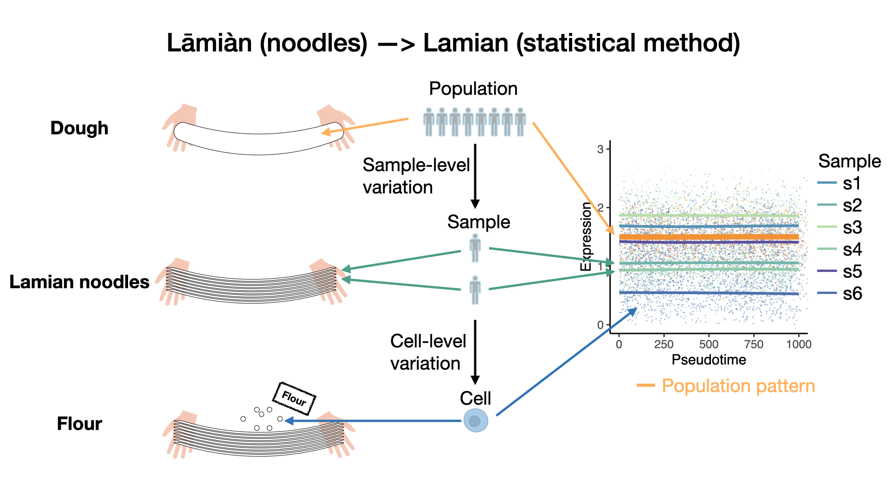

# Lamian: a statistical framework for differential pseudotime analysis in multiple single-cell RNA-seq

### Wenpin Hou, Zhicheng Ji, Zeyu Chen, E. John Wherry, Stephanie C. Hicks\*, Hongkai Ji\*
====


## Lamian Installation

Lamian software can be installed via Github.
Users should have R installed on their computer before installing Lamian. R version needs to be at least 3.5.x or higher. R can be downloaded here: http://www.r-project.org/.

For Windows users, Rtools is also required to be installed. Rtools can be downloaded here: (https://cloud.r-project.org/bin/windows/Rtools/). For R version 3.5.x, Rtools35.exe is recommended. Use default settings to perform the installation.

For mac users, if there is any problem with installation problem, please try download and install clang-8.0.0.pkg from the following URL: https://cloud.r-project.org/bin/macosx/tools/clang-8.0.0.pkg

For visualization, please download X11 or XQuartz (mac users: https://www.xquartz.org/), and then download the package Cairo using
```{r}
install.packages('Cairo')
```

To install the latest version of Lamian package via Github, run the following commands in R:
```{r }
## make sure you remove the old version of TSCAN if you've downloaded it before
if ("TSCAN" %in% rownames(installed.packages())) remove.packages('TSCAN')
## download dependencies
if (!requireNamespace("BiocManager", quietly = TRUE))
    install.packages("BiocManager")
if (!requireNamespace("ComplexHeatmap", quietly = TRUE))
    BiocManager::install('ComplexHeatmap')
if (!require("devtools"))
  install.packages("devtools")
## downlaod the most updated TSCAN from Github
devtools::install_github("zji90/TSCAN") 
## downlaod the most updated Lamian from Github
devtools::install_github("Winnie09/Lamian")
```

If there is any problem with the installation process, please make sure you have R version at least 3.5.x and you have installed Rtools (Windows users) or clang (mac users). If the problem still occurs, please contact the author (see below).


### Trouble shooting:

If you encounter difficulties in installing the R package "ComplexHeatmap", then you can download the folder and remove the "ComplexHeatmap" in the DESCRIPTION file "Imports:" list to avoid installing it (the function to plot heatmap will not work in this case). And then you run the following lines in terminal (outside the repository "Lamian"):
```{r}
R CMD BUILD Lamian
R CMD INSTALL R CMD INSTALL Lamian_0.99.0.tar.gz
``

## User Manual
You may use any of the following ways to access user manual:
(1) check the following page for the user manual: 
https://winnie09.github.io/Wenpin_Hou/pages/Lamian.html

(2) run the following commands in R, and then open the pop-up window:
```{r}
suppressMessages(library(Lamian))
vignette('Lamian')
```



## Introductions
Pseudotime analysis based on single-cell RNA-seq (scRNA-seq) data has been widely used to study dynamic gene regulatory programs along continuous biological processes such as cell differentiation, immune responses, and disease development. Existing pseudotime analysis methods primarily address the issue of reconstructing cellular pseudotemporal trajectories and inferring gene expression changes along the reconstructed trajectory in one biological sample. As scRNA-seq studies are increasingly performed on multiple patient samples, comparing gene expression dynamics across samples has been emerging as a new demand for which a systematic analytical solution is lacking. 

We develop a systematic computational and statistical framework, Lamian, for multi-sample pseudotime analysis. Given scRNA-seq data from multiple biological samples with covariates (e.g., age, sex, sample type, disease status, etc.), this framework allows one to (1) construct cellular pseudotemporal trajectory, evaluate the uncertainty of the trajectory branching structure, (2) evaluate changes in branching structure associated with sample covariates, (3) identify changes in cell abundance and gene expression along the pseudotime, and (4) characterize how sample covariates modifies the pseudotemporal dynamics of cell abundance and gene expression. Importantly, when identifying cell abundance or gene expression changes associated with pseudotime and sample covariates, Lamian accounts for variability across biological samples which other existing pseudotime methods do not consider. As a result, Lamian is able to more appropriately control the false discovery rate (FDR) when analyzing multi-sample data, a property not offered by any other methods. 


## Citation 

A statistical framework for differential pseudotime analysis with multiple single-cell RNA-seq samples. 
Wenpin Hou, Zhicheng Ji, Zeyu Chen, E John Wherry, Stephanie C Hicks\*, Hongkai Ji\*. 
bioRxiv 2021.07.10.451910; doi: https://doi.org/10.1101/2021.07.10.451910. 

This manuscript is now under revision in a peer-review journal.

## Contact

Should you encounter any bugs or have any suggestions, please feel free to contact Wenpin Hou <wh2526@cumc.columbia.edu>, or open an issue on the Github page https://github.com/Winnie09/Lamian/issues.

